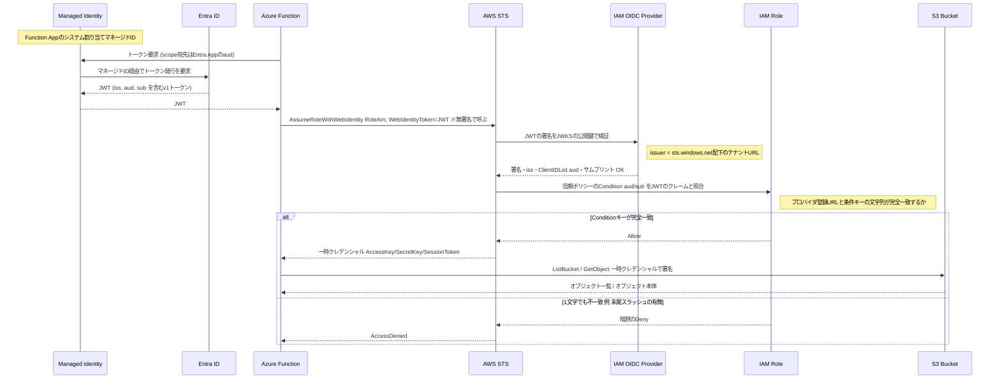

# S3_OIDC_AzureFunction

> Azure Function（マネージドID）が、長期のAWS認証情報を一切使わずにS3のファイルをダウンロードする構成（OIDCフェデレーション）

> OIDCフェデレーションの仕組み自体（JWT・信頼ポリシー・v1/v2トークンなど）が初めての場合は、先に [docs/identity/oidc-federation.md](../../docs/identity/oidc-federation.md) を読むと理解しやすい。

## Features

- **AWS**: IAM OIDCプロバイダ（Entra IDを信頼）／AssumeRoleWithWebIdentity用のIAMロール／パブリックアクセスを無効化したS3バケット
- **Azure**: システム割り当てマネージドIDを持つAzure Function（Python）／OIDCトークンの宛先になるEntra IDアプリ登録
- 長期のアクセスキーはAzure側にもAWS側にも一切保存しない
- Terraformで両クラウドを1リポジトリから管理

## アーキテクチャ

```
 Azure Function (Managed Identity)                          AWS
 ┌─────────────────────────────┐                    ┌──────────────────────────┐
 │ 1. Entra IDにトークンを要求   │                    │                          │
 │    (aud = Entra Appのaud)    │                    │  IAM OIDC Provider        │
 │                              │  2. AssumeRole      │  (issuer: sts.windows.net)│
 │                              │     WithWebIdentity │           │              │
 │                              │  ──────────────────▶│  aud/sub を検証          │
 │                              │                     │           ▼              │
 │                              │  3. 一時クレデンシャル│  IAM Role (S3 read-only) │
 │                              │◀──────────────────  │           │              │
 │ 4. 一時クレデンシャルでS3へ  │                     │           ▼              │
 │    GetObject                │  ──────────────────▶│  S3 Bucket               │
 └─────────────────────────────┘                    │  (Public Access Block)    │
                                                     └──────────────────────────┘
```

より詳細な流れ（信頼ポリシーの条件評価やJWKSでの署名検証まで含む）:



信頼ポリシーのConditionキーの完全一致がどれだけシビアか（実際にハマった例）は [docs/troubleshooting-assumerole-accessdenied.md](./docs/troubleshooting-assumerole-accessdenied.md) を参照。

詳細な手順は [docs/setup-guide.md](./docs/setup-guide.md) を参照。

## Quick Start（構築手順）

### 前提条件

- Terraform >= 1.5
- AWS CLI（認証済み。IAM/S3/OIDCプロバイダを作成できる権限）
- Azure CLI（`az login` 済み。Entra IDアプリ登録・リソース作成ができる権限）
- Python 3.11（Function をローカルで動かす場合）／ Azure Functions Core Tools（デプロイ用）

### セットアップ

このプロジェクトは **Azure → AWS → Azure** の3段階でapplyする（AzureのEntra App / マネージドIDと、AWSのOIDCプロバイダ/ロールが互いの値を必要とするため）。

1. Azure側を1回目のapply（`aws_web_identity_role_arn` は空でよい）

   ```bash
   cd terraform/azure
   cp terraform.tfvars.example terraform.tfvars   # 値を編集
   terraform init
   terraform apply
   terraform output   # entra_app_identifier_uri と function_app_principal_id を控える
   ```

2. AWS側をapply（1で控えた値を使う）

   ```bash
   cd ../aws
   cp terraform.tfvars.example terraform.tfvars   # 値を編集
   terraform init
   terraform apply
   terraform output web_identity_role_arn   # 控える
   ```

3. Azure側を2回目のapply（`aws_web_identity_role_arn` を埋める）

   ```bash
   cd ../azure
   # terraform.tfvars の aws_web_identity_role_arn に 2 の値を設定
   terraform apply
   ```

4. Functionのコードをデプロイ

   ```bash
   cd ../../src/s3_oidc_download
   func azure functionapp publish <function_app_name>
   ```

5. 動作確認

   ```bash
   curl https://<function_app_name>.azurewebsites.net/api/token-claims?code=<function-key>
   curl https://<function_app_name>.azurewebsites.net/api/files?code=<function-key>
   curl https://<function_app_name>.azurewebsites.net/api/download/hello.txt?code=<function-key>
   ```

動作確認の詳細な手順は [docs/verification.md](./docs/verification.md)、トラブルシューティングは [docs/setup-guide.md](./docs/setup-guide.md) を参照。

## ディレクトリ構成

- `terraform/aws/` - AWS側ルートモジュール（S3バケット・IAM OIDCプロバイダ・IAMロール）
- `terraform/azure/` - Azure側ルートモジュール（Entra IDアプリ・Function App）
- `terraform/modules/` - 上記から参照される再利用可能なモジュール
- `src/s3_oidc_download/` - Azure Function（Python）本体
- `sample_files/` - 動作確認用にS3へアップロードするサンプルファイル
- `docs/` - デプロイ手順・検証手順

## セキュリティ上のポイント

- S3バケットは `aws_s3_bucket_public_access_block` で全経路のパブリックアクセスを無効化している
- IAMロールの信頼ポリシーは `aud`（トークンの宛先）に加えて `sub`（マネージドIDのオブジェクトID）も検証し、同一テナント内の他のIDによるAssumeを防いでいる
- Function Appにはアクセスキーを一切設定しない。環境変数に入っているのはロールARNとトークンスコープ（宛先の識別子）のみで、これ自体は秘密情報ではない

