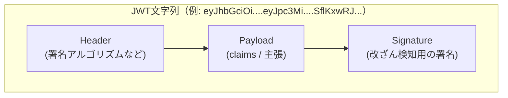
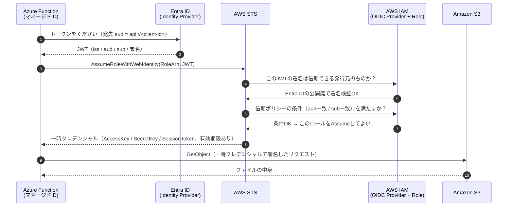
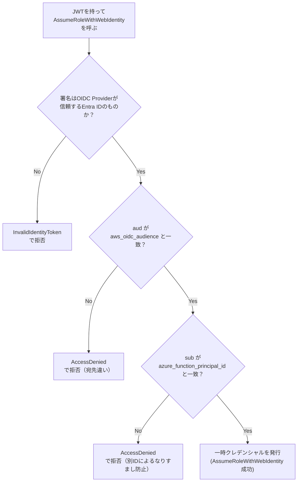

# OIDCフェデレーションとは何か（Azure Function → AWS S3 の例で理解する）

対象読者: OIDC・JWT・STSといった単語を初めて見る人。
題材: [Cross-Cloud/S3_OIDC_AzureFunction](../../Cross-Cloud/S3_OIDC_AzureFunction/) の実装（Azure FunctionのマネージドIDがAWS S3のファイルをダウンロードする構成）。

このドキュメントは「なぜこう作ったか」を理解するための解説。実際の構築手順は [setup-guide.md](../../Cross-Cloud/S3_OIDC_AzureFunction/docs/setup-guide.md) を参照。

---

## 1. そもそも何が課題だったのか

Azure Functionのようなクラウド上のアプリが、別のクラウド（AWS）のリソースにアクセスしたい場合、素朴な方法は「AWSのアクセスキー（Access Key ID / Secret Access Key）をFunctionの設定に貼り付ける」というものになる。

これには構造的な弱点がある。

- **漏洩リスク**: 環境変数・ログ・リポジトリなど、キーが写り込む経路が多い。一度漏れると、無効化するまで誰でも使える
- **失効しない**: アクセスキーは明示的に無効化しない限り永久に有効（＝「長期クレデンシャル」と呼ばれる）
- **ローテーション運用**: 定期的に鍵を作り替えて配布し直す運用が必要になり、忘れられがちで放置される

**OIDCフェデレーション**は、この「長期の鍵を持ち歩く」という発想そのものをやめる方式。代わりに、Azure側の「私はこのマネージドIDです」という身元をAWSが信頼する仕組みを作り、必要な瞬間だけAzureがEntra ID（Microsoftの認証基盤）に「短時間だけ使える身分証（トークン）」を発行してもらい、それをAWSに提示して一時的な鍵と交換する。

| | 長期アクセスキー方式 | OIDCフェデレーション方式 |
|---|---|---|
| AWSに渡す秘密情報 | Secret Access Key（半永久） | なし |
| 漏洩時の影響 | 無効化するまで使われ続ける | トークンは短時間（既定1時間）で自動失効 |
| ローテーション運用 | 必要 | 不要（毎回新しいトークンを取得するため） |
| 誰の身元を証明するか | 「鍵を知っている」こと自体 | Entra IDが「このマネージドIDである」ことを署名付きで保証 |

---

## 2. 登場人物と用語

| 用語 | 正体 | このプロジェクトでの実体 |
|---|---|---|
| **OIDC** (OpenID Connect) | 「これは誰か」を証明するための標準規格。OAuth2.0の上に作られている | Entra IDが対応しているプロトコル |
| **IdP** (Identity Provider) | 身元を証明してトークンを発行する側 | Entra ID（Azure AD） |
| **RP** (Relying Party) | IdPの発行したトークンを信頼して使う側 | AWS（IAM OIDC Provider経由） |
| **マネージドID** (Managed Identity) | Azureリソースに自動で割り当てられる「身分」。パスワード管理が不要 | Azure FunctionのSystem Assigned Identity |
| **JWT** (JSON Web Token) | IdPが発行する、署名付きの身分証データ | Entra IDが発行するIDトークン |
| **STS** (Security Token Service) | 一時的な認証情報を発行するAWSのサービス | `sts:AssumeRoleWithWebIdentity` API |

---

## 3. JWTの中身

JWTは `ヘッダー.ペイロード.署名` という3つのBase64文字列を`.`で繋いだだけの文字列。暗号化はされておらず、誰でもペイロードをデコードして中身を見られる（安全性は「署名が正しいこと」で担保する）。

このプロジェクトで重要なのは **Payload に入っているclaim（主張）**:

| claim | 意味 | このプロジェクトでの値 |
|---|---|---|
| `iss` (issuer) | 誰が発行したトークンか | `https://sts.windows.net/<テナントID>/`（v1トークンの場合） |
| `aud` (audience) | 誰向けのトークンか | Entra IDアプリの識別子（`api://<client-id>`） |
| `sub` (subject) | トークンの主体は誰か | Azure FunctionのマネージドIDのオブジェクトID |
| `exp` (expiration) | 有効期限（UNIX時間） | 発行から短時間（通常1時間程度） |

`/api/token-claims`（このプロジェクトのデバッグ用エンドポイント）は、まさにこの`iss`/`aud`/`sub`を確認するために用意してある。

**署名の検証**は「公開鍵暗号」で行う。Entra IDは秘密鍵でJWTに署名し、AWSはEntra ID側が公開しているサーバー証明書（公開鍵に相当）を使って署名を検証する。AWSのIAM OIDCプロバイダに登録する「サムプリント（拇印）」は、この証明書チェーンの指紋であり、「このURLの証明書チェーンを信頼する」という設定になる。

---

## 4. 全体の流れ（シーケンス図）

ポイントは、**Azure Function自身は一度もAWSの長期クレデンシャルを持たない**こと。持っているのは「Entra IDから発行された、短時間しか使えないJWT」だけで、それをAWS STSに提示するたびに、STSがその場で一時クレデンシャルを発行してくれる。

---

## 5. AWS側は何を信頼しているのか（信頼ポリシーの評価）

AWS側には2つの設定がある。

1. **IAM OIDC Provider**: 「`https://sts.windows.net/<テナントID>` という発行元（Entra ID）を信頼する」という登録
2. **IAMロールの信頼ポリシー（Trust Policy）**: 「①のOIDC Providerが発行したトークンのうち、`aud`と`sub`が特定の値と一致するものだけ、このロールのAssumeを許可する」という条件

### なぜ `sub` の条件が重要なのか

`aud`（宛先）だけを見る設定にしてしまうと、**同じEntra IDテナント内の他のマネージドID**（このプロジェクトとは無関係な別のFunctionやVMなど）でも、たまたま同じ `aud` 宛てのトークンを取得できれば、このロールをAssumeできてしまう。

`sub`（トークンの主体＝マネージドIDのオブジェクトID）まで条件に含めることで、「このマネージドID **だけ**」に絞り込める。これが [terraform/modules/aws/sts_oidc_flow](../../Cross-Cloud/S3_OIDC_AzureFunction/terraform/modules/aws/sts_oidc_flow/main.tf) の信頼ポリシーで `aud` と `sub` の両方を条件にしている理由。

---

## 6. v1トークンとv2トークンの違い（詰まりやすいポイント）

Entra IDは同じ仕組みで2種類のフォーマットのトークンを発行できる。**このプロジェクトの動作確認で一番間違えやすいのはここ。**

| | v1トークン | v2トークン |
|---|---|---|
| `iss`（発行者URL） | `https://sts.windows.net/<tenant-id>/`（末尾スラッシュあり） | `https://login.microsoftonline.com/<tenant-id>/v2.0` |
| `aud`（宛先） | アプリケーションID URI（例: `api://<client-id>`） | クライアントID（GUIDそのもの） |
| マネージドIDが取得するトークン | 通常こちら（既定） | 明示的に要求した場合 |

このリポジトリのTerraformは既定で `azure_token_version = "v1"` を前提にしている。もし実際のトークンが想定と違う版で発行されていたら、AWS側の `iss`（信頼するOIDC ProviderのURL）と `aud` の形式が食い違い、`InvalidIdentityToken` や `AccessDenied` になる。**必ず `/api/token-claims` で実測してから合わせる**（[setup-guide.md](../../Cross-Cloud/S3_OIDC_AzureFunction/docs/setup-guide.md) の検証手順を参照）。

---

## 7. このプロジェクトの変数とJWT claimの対応表

Terraformの変数名と、それがJWTのどのclaimと突き合わされるのかを一覧にしておく。

| Terraform変数（`terraform/aws`） | 突き合わされるJWT claim | 出どころ |
|---|---|---|
| `azure_tenant_id` | `iss` に含まれるテナントID | Azure CLI (`az account show`) |
| `azure_token_version` | `iss` のURL形式（v1/v2どちらか） | `/api/token-claims` で実測 |
| `azure_oidc_audience` | `aud` | `terraform/azure` の出力 `entra_app_identifier_uri` |
| `azure_function_principal_id` | `sub` | `terraform/azure` の出力 `function_app_principal_id` |

`terraform/azure` を先にapplyしてこれらの値を得てから `terraform/aws` をapplyする、という手順（[README.md](../../Cross-Cloud/S3_OIDC_AzureFunction/README.md) の3段階apply）は、この対応表を埋めるために必要な情報がAzure側にしか存在しないから。

---

## 8. まとめ

- OIDCフェデレーションは「長期の鍵を渡す」代わりに「短時間だけ有効な署名付き身分証（JWT）」を都度発行してもらい、それを信頼済みの相手（AWS STS）に提示して一時クレデンシャルと交換する仕組み
- AWS側はJWTの**署名**（本当にEntra IDが発行したか）と**claim**（`aud`=宛先、`sub`=主体）の両方を検証してから初めて一時クレデンシャルを発行する
- `sub` 条件を外すと「テナント内の誰でもAssumeできる」ことになるため、必ず特定のマネージドIDに絞り込む
- v1/v2トークンの違いは実測してから合わせる。思い込みで設定すると必ずハマる

## 参考

- [AWS IAM: OpenID Connect ID プロバイダーの作成](https://docs.aws.amazon.com/ja_jp/IAM/latest/UserGuide/id_roles_providers_create_oidc.html)
- [AWS STS: AssumeRoleWithWebIdentity](https://docs.aws.amazon.com/ja_jp/STS/latest/APIReference/API_AssumeRoleWithWebIdentity.html)
- [Microsoft Entra: アクセストークンの要求と使用](https://learn.microsoft.com/ja-jp/entra/identity-platform/access-tokens)
- [OpenID Connect Core 1.0（仕様本体）](https://openid.net/specs/openid-connect-core-1_0.html)
